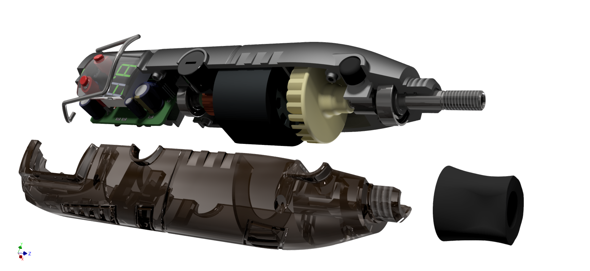
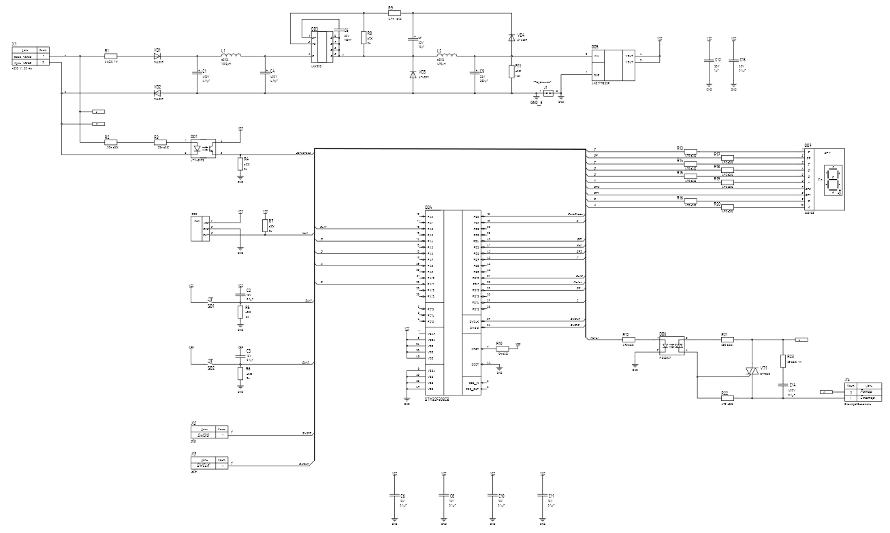

# Motor Controller

This is a project of mini motor controller for drilling machines like "Hilda" and others or for some collector motors with maximum input power of 170W.

It includes hardware part, that exists of .schdoc and .pcbdoc;
    and the software part (look in "Software" folder)

### Model

### Schematic

### PCB

